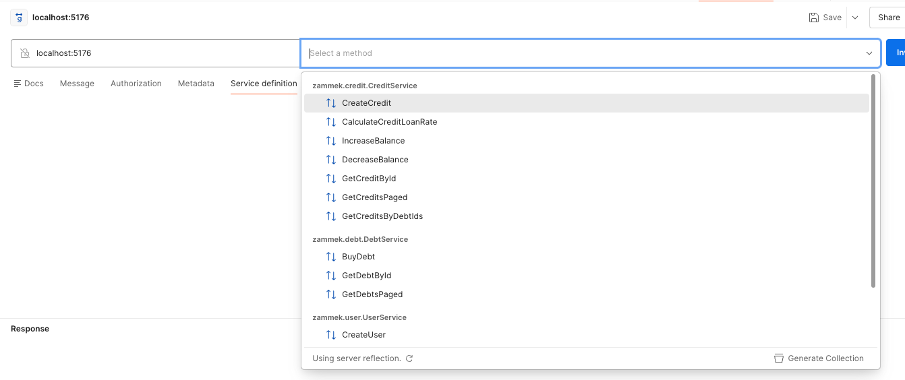
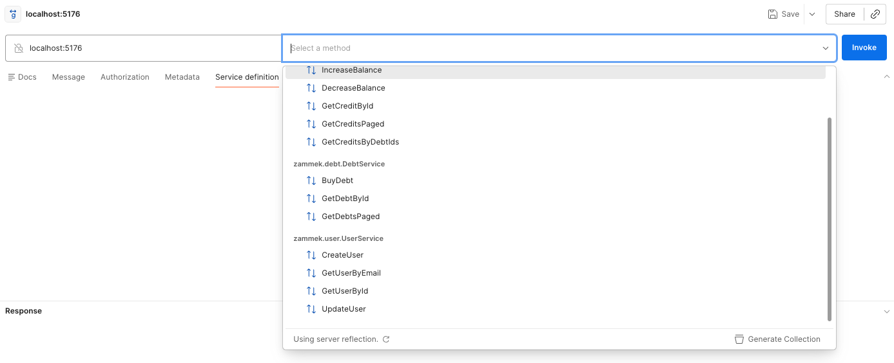
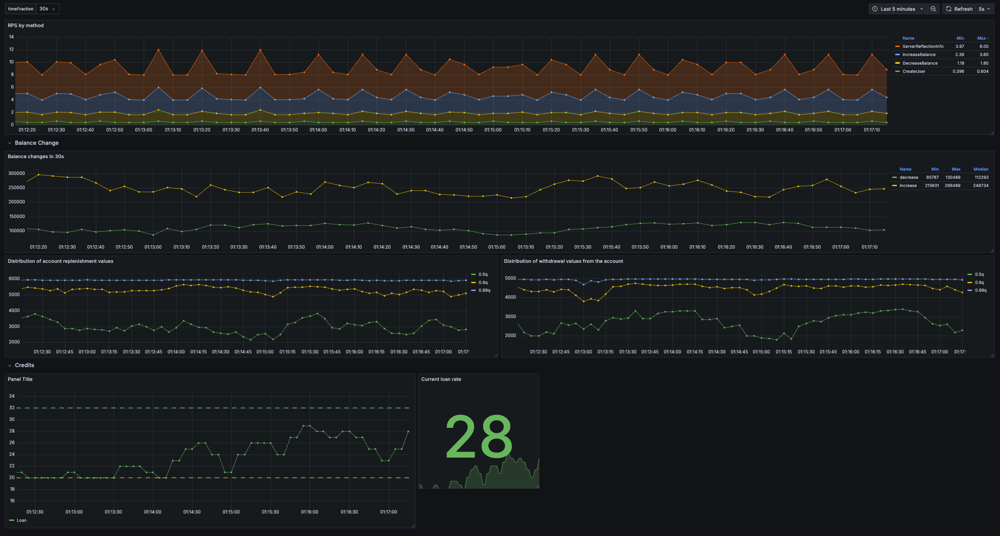
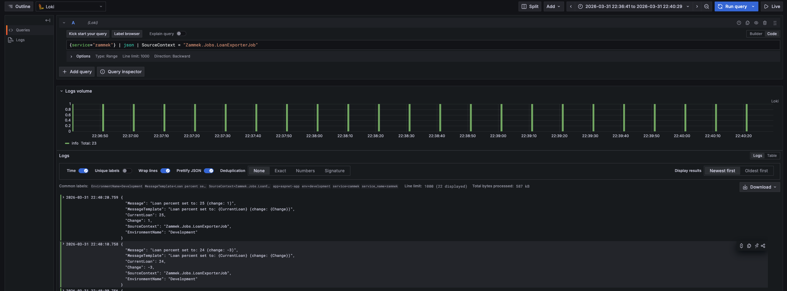
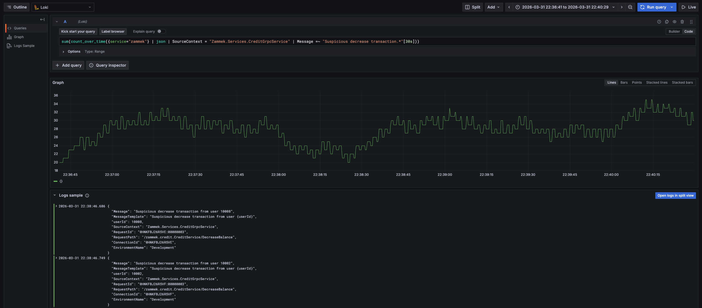
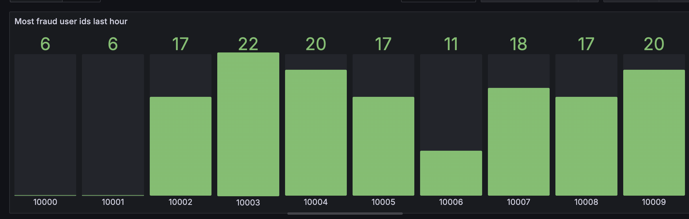
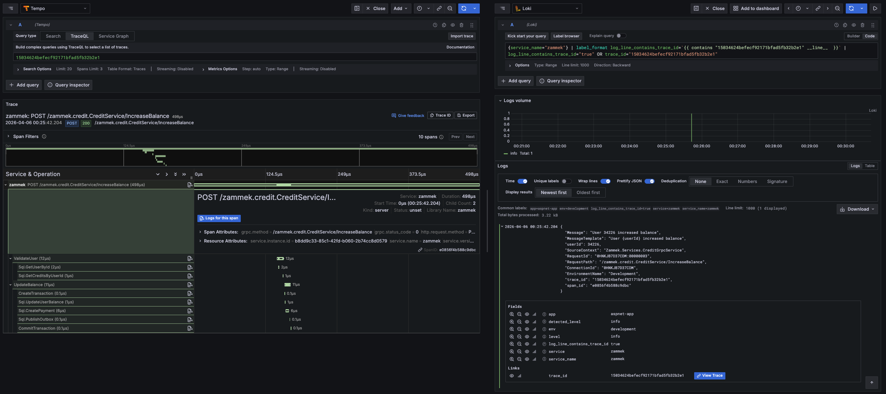
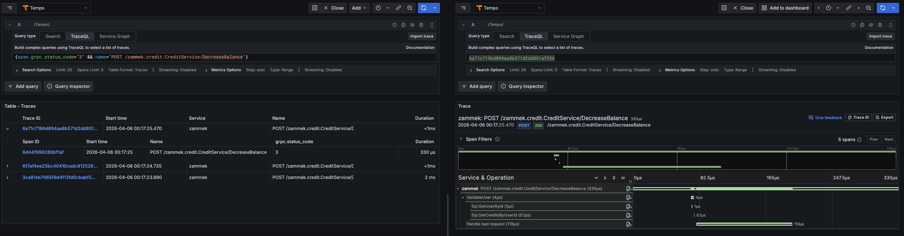
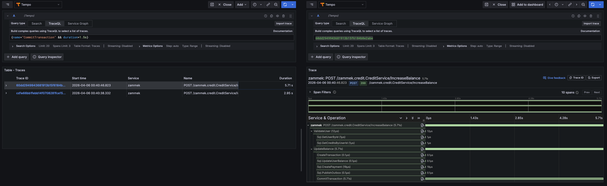

# ZAMMEK

## Оглавление
1. [Артефакты API](#артефакты-api-лр2)
2. [Метрики ЛР 3](#метрики-лр-3)
3. [Логи ЛР 4](#логи-лр-4)
3. [Трейсы ЛР 5](#трейсы-лр-5)

API для микрокредитной организации, занимающейся продажей долгов на собственной бирже.

Состоит из файлов
```
.
├── README.md
├── Zammek
│   └── Protos
│      ├── credit.proto
│      ├── debt.proto
│      ├── user.proto
│      └── google/type/money.proto

```
Описание:
* [credit.proto](./Zammek/Protos/credit.proto) - API для сервиса кредитов
* [debt.proto](./Zammek/Protos/debt.proto) - API для сервиса долгов
* [user.proto](./Zammek/Protos/user.proto) - API для сервиса управления пользователям
* [money.proto](./Zammek/Protos/google/type/money.proto) - описание стандартного google protobuf типа для передачи денежных значений

Как проверить работоспосность:
1. Иметь установленным dotnet версии 10 и выше
2. Запустить в корне dotnet build 

## Артефакты API (ЛР2)
ServerReflectionInfo:



## Метрики (ЛР 3)
Используемый стек: Grafana + Prometheus \
Отображались:
* Суммарный RPS
* Изменения баланса счетов пользователей
* Квантили размеров транзакций на списание/пополнени кредитных счетов
* Текущая ставка по кредитам (менялась раз в 10 секунд рандомно от 20 до 32)



## Логи (ЛР 4)
Используемые стек: Grafana + Loki \
Созданы следующие запросы:
1. Изменения процентной ставки по кредитам


2. Количество подозрительных списаний на отрицательный баланс в окне 30s


3. Визуализация для отображения 5 самых частых пользователей, которые пытаются сделать отрицательные списания со счета
```
topk(5,
  sum by (userId) (
    count_over_time(
      {service="zammek"} 
      | json 
      | SourceContext = "Zammek.Services.CreditGrpcService" 
      | Message =~ "Suspicious decrease transaction.*"
      | userId != "" 
      [1h]
    )
  )
)
```


## Трейсы (ЛР 5)

Используемый стек: Grafana + Tempo. Также была настроена интеграция с отображением логов по определенным трейсам из
Loki  \
Пример трейса c логами по нему:

Пример поиска трейсов:
1. Поиск трейсов, имеющие grpc статус InvalidArgument для ручки снятия средств с баланса

2. Поиск трейсов, в которых commit транзакций занимает больше 1.5 секунды

